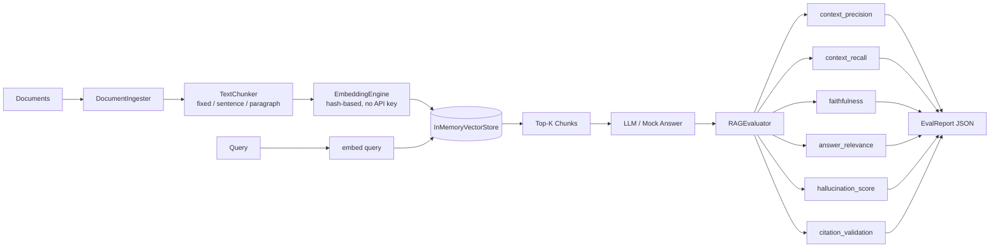

# RAG Testing Framework


A **hands-on QA framework** for testing Retrieval-Augmented Generation (RAG) pipelines.
Built from scratch to understand how RAG systems fail and how to write systematic tests
that catch those failures before they reach users.

---

## Problem This Solves

RAG systems fail in ways that are hard to catch without purpose-built tests:

| Failure Mode | What Goes Wrong | Metric That Catches It |
|---|---|---|
| Wrong chunks retrieved | Context doesn't contain the answer | Context Recall |
| Irrelevant chunks retrieved | Context is present but off-topic | Context Precision |
| Hallucinated answer | Answer contains facts not in context | Faithfulness |
| Off-topic answer | Answer doesn't address the question | Answer Relevance |
| Fabricated citations | Cited source doesn't support claim | Citation Validation |
| Model invents facts | Claims with no grounding at all | Hallucination Score |

---

## Architecture



---

## Folder Structure

```
rag-testing-framework/
├── .github/workflows/ci.yml
├── docs/
│   ├── interview-notes.md
│   └── resume-bullets.md
├── src/
│   ├── pipeline/
│   │   ├── __init__.py
│   │   ├── ingester.py          # Document loading from text/files
│   │   ├── chunker.py           # Fixed / sentence / paragraph splitting
│   │   ├── embedder.py          # Hash embeddings (no API key needed)
│   │   ├── vector_store.py      # In-memory cosine similarity search
│   │   └── rag_system.py        # Orchestrates the full pipeline
│   ├── metrics/
│   │   ├── __init__.py
│   │   ├── precision_recall.py  # Context precision + recall
│   │   ├── faithfulness.py      # Faithfulness + hallucination
│   │   ├── relevance.py         # Answer relevance
│   │   └── citations.py         # Citation validation
│   └── utils/
│       ├── __init__.py
│       └── text_utils.py        # Token overlap helpers
├── tests/
│   ├── conftest.py
│   ├── test_ingestion.py
│   ├── test_chunking.py
│   ├── test_embedder.py
│   ├── test_vector_store.py
│   ├── test_rag_system.py
│   └── test_metrics.py
├── sample_docs/
│   ├── python_overview.txt
│   └── cloud_computing.txt
├── data/golden/
│   └── golden_qa_pairs.json
├── .gitignore
├── pytest.ini
└── requirements.txt
```

---

## Setup

```bash
git clone https://github.com/guruambati/rag-testing-framework.git
cd rag-testing-framework
python -m venv venv
source venv/bin/activate
pip install -r requirements.txt
```

---

## Run Tests

```bash
# All tests
pytest

# With coverage
pytest --cov=src --cov-report=term-missing

# Single module
pytest tests/test_metrics.py -v
```

---

## Quick Example

```python
from src.pipeline.rag_system import RAGSystem
from src.metrics.faithfulness import FaithfulnessMetric

rag = RAGSystem(chunk_size=300, strategy="sentence")
rag.add_file("sample_docs/python_overview.txt")

results = rag.retrieve("What is Python used for?", top_k=3)
chunks  = [r.chunk.text for r in results]
answer  = "Python is used for web development, data science, and automation."

score = FaithfulnessMetric().evaluate(answer, chunks)
print(score)
# EvalResult(metric='faithfulness', score=0.82, passed=True, threshold=0.7)
```

---

## Sample Test Output

```
tests/test_ingestion.py::TestIngestion::test_ingest_text_returns_document    PASSED
tests/test_chunking.py::TestChunking::test_fixed_chunks_produced             PASSED
tests/test_chunking.py::TestChunking::test_no_chunk_exceeds_size             PASSED
tests/test_vector_store.py::TestVectorStore::test_search_ranked_descending   PASSED
tests/test_metrics.py::TestFaithfulness::test_grounded_answer_passes         PASSED
tests/test_metrics.py::TestHallucination::test_hallucinated_answer_scores_high PASSED
tests/test_metrics.py::TestCitationValidation::test_valid_citation_passes    PASSED

========== 62 passed in 1.23s ==========
```

---

## Tech Stack

Python 3.11 · pytest · dataclasses · math (stdlib) · re (stdlib) · GitHub Actions
No paid API key required — uses deterministic hash-based embeddings for full offline testing.

---

## Resume Bullets

See [`docs/resume-bullets.md`](docs/resume-bullets.md)

## Interview Notes

See [`docs/interview-notes.md`](docs/interview-notes.md)
